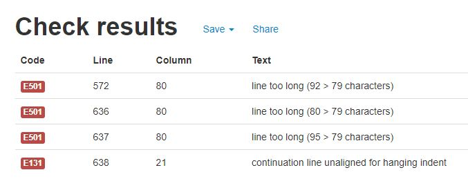

# Bike Hire System

## Portfolio Project 3 - Python Essentials

The purpose of this project was to create a booking system whereby users can submit a Google form to enquire about bike hire, and if there are bikes available, the system will book these bikes out against a calendar, and send a confirmation email to both the user and shop owner. 

# Table of Contents
- [Important links](#important-links)
- [How to run](#how-to-run)
- [Features](#features)
    - [Google Form](#google-form)
    - [Google Sheets](#google-sheets)
        - [Responses List](#responses-list)
        - [Bike List](#bike-list)
        - [Size Guide](#size-guide)
        - [Calendar](#calendar)
        - [Bookings](#bookings)
    - [Python Code](#python-code)
        - [Main Functions](#main-functions)
        - [Error Checking](#error-checking)
    - [Confirmation Emails](#confirmation-emails)
        - [Booked Bikes](#booked-bikes)
        - [Problem](#problem)
    - [Future Possible Features](#future-possible-features)
- [Technologies Used](#technologies-used)
- [Development](#development)
- [Limitations](#limitations)
- [Testing](#testing)
    - [Functionality Testing](#functionality-testing)
    - [Code Validation](#code-validation)
- [Deployment](#deployment)
- [Credits](#credits)
- [Acknowledgements](#acknowledgements)

# Important Links
See below a list of important links to run this project.  It may be helpful to Bookmark them.

* [Google Sheets](https://docs.google.com/spreadsheets/d/1OVm1E1Y4fHbadi8lmTDPpSb8AZ8jk7E__jBj3q6E0us/edit#gid=869283822)
    * [Google Sheets Access Link](https://docs.google.com/spreadsheets/d/1OVm1E1Y4fHbadi8lmTDPpSb8AZ8jk7E__jBj3q6E0us/edit?usp=sharing)
* [Google Forms](https://docs.google.com/forms/d/e/1FAIpQLSf65gwDPHQ-m0Fo5ZylJY6MdEva9j5YLtU0maKbP4wvLUBw-Q/viewform)
* [Heroku App](https://bike-hire-ms3.herokuapp.com/)
* [Github Project](https://github.com/MojosBeans100/MS3-bike-hire)
* [MailTrap](https://mailtrap.io/)
    * [Mailtrap Access Link](https://mailtrap.io/share/1059510/71ec0aa5f495037c06e12ebaebc9e6c1)

# How to run
The system should be set up so that for the initial run, a form has been submitted containing the details below, but the code has not yet been run for that form.  Therefore, when the Heroku link is clicked and run, it should process this form. 

* Booking Number: 5
* Booking Name: Patch Adams
* Booking Dates: 
* Number of bikes requested: 3

It is then up to the tester to submit more forms and re-run the Heroku link.  Recommended steps:

1. Submit a bike hire enquiry via the Google Form. 
2. Check the *form_responses* worksheet in Google Sheets to see details of the form. 
3. Run the program.
4. Check the *calendar2* worksheet to see if a booking has been made for that booking number.
5. Check the *bookings* worksheet to see if the booking has been appended.
5. Check the emails in Mailtrap to see if an email has been delivered.

# Features
## Google Form
[Google Forms](https://docs.google.com/forms/d/e/1FAIpQLSf65gwDPHQ-m0Fo5ZylJY6MdEva9j5YLtU0maKbP4wvLUBw-Q/viewform)

* The Google Form should be found as a link on the bike shop's (hypothetical) website.
* The form consists of basic contact information, then options to book bikes.
* There is a choice of bike type, and the rider should input their height to allow the correct bike size to be matched to them.
* The user can allow alternative choices for their bikes if they wish - for example, a different bike type but in the same size.
* Once submitted, the information from the form is pushed to the Google Sheets database. 

  

[Back to Table of Contents](#table-of-contents)

## Google Sheets
[Google Sheets](https://docs.google.com/spreadsheets/d/1OVm1E1Y4fHbadi8lmTDPpSb8AZ8jk7E__jBj3q6E0us/edit#gid=869283822)

### Responses List
The information submitted from the Google Form is pushed to this worksheet. 
The last submitted form, or the last row in this sheet, is what is used in the Python Code. 
Each form is assigned a booking number, which is input into the calendar when booking bikes against dates. 

### Bike List
This worksheet is an exhaustives list of all the bikes available in the bike shop. 
Each bike is assigned a 'bike index' - a number which will reference to that bike.  This is used frequently in the Python code. 
Each bike also has a brand, description, size, category, price and availability assigned to it. 

The owner should maintain this bike list carefully.
If a bike is unavailable - eg it has been sold - the owner should mark it as unavailable (select 'No' in column G).  
This gives this bike a blanket unavailability, and it should not be able to be booked at all, on any given dates. 

If new bikes are bought in, they can be added to the bottom of the list, as opposed to deleting rows, or overwriting current bikes.

### Size Guide
This size guide references the correct bike size for various heights.
The user will add their heights to each bike when submitting the form.

### Calendar
The calendar displays which bikes have been booked against which dates, and for which booking number.

For example, in the below picture, it can be seen that for Booking Number 5, two bikes bikes (Bike Index 1, Bike Index 7) have been booked from the 18th - 24th Aug. 

Booking Number 7 has booked Bike Index 10 for 27th - 29th Aug, and so on. 

### Bookings
This worksheet adds the booking information to a list, once bikes are booked. 

It will only do this if the bikes *have been booked*, which is different to the responses list, which does not necessarily result in a booking.

This allows the owner to look at the calendar, and reference information about that booking number if required. 

### Sort Data
This worksheet is largely irrelevant to the owner, simply providing some data validation and basic calculations in the spreadsheet. 

## Python Code

### Main Functions

1. The code initially retrieves information from the Google Sheets database, which was submitted by the user on the Google Form (function: get_latest_response) and outputs a list of dictionaries, with all relevant information about the bikes requested.

2. It uses the rider heights to match to the revelant bike size (function: match_size) and appends this information to the bike dictionaries for each bike.

3. It matches the price of the bike also, which varies depending on the bike type (function: match_price) and appends this information to the bike dictionaries for each bike. 

4. It looks at the calendar in the Google Sheet, as well as the hire dates requested from the user, and returns a list of unavailable bikes for those dates (function: find_unavailable_bikes).  This function is important to ensure no double bookings. 

5. It iterates through the bikes which are still available, to match up both the bike type and bike size, and return a list of suitable bikes for each bike in the bike dictionary (function: match_suitable_bikes).

6. There is another availability checking function (function: remove_unavailable_bikes) to remove any bikes from the list of unavailable bikes from any bike dictionaries that bike index appears in.  Therefore it should not be possible to 'book' this bike again. 

7. It then iterates through the list of possible bikes for each bike dictionary (function: book_bikes), chooses one of the bike indexes, and calls up another function (function: book_bikes_to_calendar) which writes the requested hire dates in the calendar against the chosen bike index.

8. It then separates the list of bike dictionaries into two separate ones, one for booked bikes, and one for bikes which could not be booked on that iteration (function: booked_or_not). 
 
9. If there are any bikes which could not be booked, it then looks for alternatives by changing the bike type.  It is more important for the rider to be riding a bike of the correct size, but manageable to provide them with a different bike type if they wish (function: find_alternatives).  This then repeats steps 3 - 9.

10. It then performs a validation function to ensure there have been no double bookings (function: check_double_bookings), calculates the cost of the hire based on bikes booked (function: calculate_cost), retrieves additional information required to send confirmation email (function: booking_details) and creates a string message, and adds to the bookings list (function: add_booking_to_gs).

11. Lastly, the code sends out a confirmation email to both the user and the owner. 

See the process flow below:

[Back to Table of contents](#table-of-contents)

### Error Checking

There are several situations in which an error could occur with a booking system - this code attemps to prevent most of them. 

Errors call up the function error_func, which exits the code with a raise SystemExit,and notifies both the user and owner that there has been a problem with the booking. 

1. Invalid dates - the Google Form does allow for past dates to be submitted.  In the function find_unavailable_bikes, a quick check is performed to ensure that the start of hire date is after today's date. 

2. Double booking - this is one of the more concerning errors, and the code should not allow this to occur. 

    * The shop owner has the ability to choose a blanket availability to each bike index.  This allows for, for example,  mechanical problems with bikes thus rendering them unbookable for a few days, or the bike is sold and no longer present in the hire fleet.

    * The code checks the dates in the calendar and returns unavailable bikes for those dates.

    * If a bike is booked, the code removes that bike index from all other bike dictionaries, and appends it to the unavailble bikes list.

    * The code checks and re-checks bikes availability each time the code is run.

    * The code checks that the number of cells filled into the calendar during the booking process is equal to the number of cells filled in before current booking + (number of dates of hire x the number of bikes booked) - (function: check_double_bookings). 

    * Should an unavailable bike not be added to the unavailable bikes list, the code also ensures that when writing the booking number to the calendar, it can only do so into blank cells. 

3. Form already processed - if the booking number already appears in the bookings list, the process will stop, to avoid re-booking this booking. 

## Confirmation emails
### Booked Bikes
A confirmation email is sent to both the user and owner when bikes have been booked.

The email to the user provides all details of the booking, and some additional 'useful to know' information.  
It is kept basic in terms of content - it is assumed that the hypothetical website would host most information required for hiring (eg what to bring, cancellation terms etc) - and style.

The email sent to the owner is simply to notify that a booking has been made, and to urge them to check the details.

[Mailtrap](https://mailtrap.io/) was used as the Email Sandbox Service system. 

See link to the Mailtrap invite, to witness emails being sent and received.  An account will need to be created. 
[Share link](https://mailtrap.io/share/1059510/71ec0aa5f495037c06e12ebaebc9e6c1)

User email confirmation:

Owner email confirmation:

[Back to Table of Contents](#table-of-contents)

### Problem
An email is also sent to both user and owner if there has been an issue with the booking (see [Error Checking](#error-checking)). 

Email to user:

Email to owner:

## Future possible features
* There should be a website whereby the user can access the form. On this website could be a calendar, where users can see which bikes are and are not available on the dates they wish to hire.  This would be automatically updated by the system to block out dates when no longer available. 

For example, see similar booking system idea here for a campervan rental site:

* The confirmation email could specify which bikes were original choices, and which were alternatives, and what the alternatives chosen were. 

* There could be an additional feature to remove the last booking.  This may be required by the owner, and would currently involve manually deleting this information from various worksheets in the workbook. 

* If the user was not happy with alternative bikes, the code still books in those that are available.  
For example, if they book two bikes, one of which is available and one which is not available, the code will still book in the available one.  
In reality, this might not make sense as in that case the user would most likely prefer to simply cancel the booking entirely. 
The code could be re-written:  if the user is not happy with alternatives, ensure all bikes are found before actually writing them to the calendar. 

* It is possible an error may occur if the Google Form is inadequately filled out: in particular, it was discovered during testing that if a bike type is selected but the size is not, the code will return an error.  This could be fixed with a short loop at the start to check all necessary fields have been filled out, or within Google Forms there may be a function to require the size field if the type field is selected.  However, if the size field was made a requirement, it would be necessary for the user to fill out information for all 5 bikes, when they may only wish to book less than 5.

* There is no doubt a wealth of refactoring which could be carried out to run this code more efficiently.

[Back to Table of Contents](#table-of-contents)

# Technologies Used:
### Programming Languages:
* Python

### Git
* Git was used for version control by utilizing the Gitpod terminal to commit to Git and Push to GitHub.

### Github
* GitHub is used to store the projects code after being pushed from Git.

### Lucidchart
* Lucidchart was used to map the workflow for the game.

### Code Institutes Mock Terminal
* Code Institute provided a mock terminal for use for the project.

### Google Sheets
* Google Sheets was used to store the bikes information. 

### Google Forms
* Google Forms was used to create the bike hire form to be submitted by the user. 

### Mailtrap
* Mailtrap was used as an email sandbox to verify email functions in code were working.

### Heroku
* Heroku was used to deploy the program. 

[Back to Table of Contents](#table-of-contents)

# Development
* In order to access Google Sheets, the gspread module was imported and credentials from the google.oauth2.service_account.
* In order to re-format the dates, *datetime* was imported.
* In order to send emails, *smtplib* was imported.

Throughout developement, several infinite loops were discovered, and the author has made an attempt to remedy these and exit the code elegantly by correcting the code or with raise SystemExit.

# Limitations
### Number of bikes available for hire
There had to be a limit to how many bikes which could be hired, therefore this was limited to 5 bikes per form.  
In the author's experience from running a similar business, generally larger bookings should be handled differently anyway.

### Number of days available for hire
Similarly, there is a maximum length of hire (10 days) and any hire longer than this can be dealt with manually with the shop owner.
 
# Testing
## Functionality testing
* The code was tested numerous times, with varying scenarios in Gitpod to validate results. 
* The Github link was sent to friends and family in order to test, and ensure access to all necessary systems was possible.

## Code Validation
* The code was checked using [Pep8online](http://pep8online.com/) checker.
* A small number of errors were found relating to length of lines, and where possible these were separated with \ or hushed with # noqa. 

[Back to Table of Contents](#table-of-contents)

# Issues
The author's Gitpod workspace was stuck in the 'Stopping' loading screen for a while on Sunday 15th August.  On research into similar issues many other students have had, the decision was made swiftly to create an entirely new workspace (since all changes had been recently pushed to Github and therefore backed up), as opposed to raising a ticket with Gitpod and potentially losing hours or days of work time in the run up to the project submission date. 

With this in mind, the author has provided links to two Github repositories - one being the initial version with ~ 90% of commits (named 'bike-hire), and the second workspace ('MS3-bike-hire') into which text from run.py in 'bike-hire' was copied and pasted, resulting in a large commit of ~ 800 changes in one go. 

* [bike-hire Github](https://github.com/MojosBeans100/bike-hire)
* [MS3-bike-hire Github](https://github.com/MojosBeans100/MS3-bike-hire)

The author requests that the project grader reviews the commits from 'bike-hire' to ensure no assumptions are made on plagiarism when noticing the unusual nature of commits on 'MS3-bike-hire'. 

 

[Back to Table of Contents](#table-of-contents)

# Deployment
The site was deployed to GitHub pages. The steps to deploy are as follows:
* In the GitHub repository, navigate to the Settings tab
* From the source section drop-down menu, select the Master Branch
* Once the master branch has been selected, the page will be automatically refreshed with a detailed ribbon display to indicate the successful deployment.
* The live link can be found here 
 > [MS3-bike-hire](https://github.com/MojosBeans100/MS3-bike-hire)

To run locally:
* Log in to GitHub and click on repository to download [MS3-bike-hire](https://github.com/MojosBeans100/MS3-bike-hire)
* Select `Code` and click Download the ZIP file.
* After download you can extract the file and use it in your local environment 

Alternatively you can [Clone](https://docs.github.com/en/free-pro-team@latest/github/creating-cloning-and-archiving-repositories/cloning-a-repository)
or [Fork](https://docs.github.com/en/free-pro-team@latest/github/getting-started-with-github/fork-a-repo)
this repository ([MS3-bike-hire](https://github.com/MojosBeans100/MS3-bike-hire)) into your github account.

The project was then deployed to Heroku using the following steps:

* Log in to Heroku and add a new app.
* Link the project from GitHub to Heroku.
* Add the CREDS.JSON file to the ConfigVars in Settings.
* Add the Python and NodeJS buildpacks.
* Manually deploy the project.
> [MS3 Bike Hire in Heroku](https://dashboard.heroku.com/apps/bike-hire-ms3/deploy/github)
(https://bike-hire-ms3.herokuapp.com/)

# Credits
* [Mailtrap Blog](https://mailtrap.io/blog/sending-emails-in-python-tutorial-with-code-examples/)
* [Information about bike sizing](https://www.evanscycles.com/help/bike-sizing-mountain)

# Acknowledgements
* I'd like to thank my mentor who is always available to advise, encourage, and help when needed.
* I'd like to thank the owner of Progression Bikes, who provided me with useful information about the bike hire and booking process.
* I'd like to thank my brother, Euan, who is not too bad at Python himself and problably saved me many hours debugging thoses problems which stem from Python's idosyncrasies.

[Back to Table of Contents](#table-of-contents)